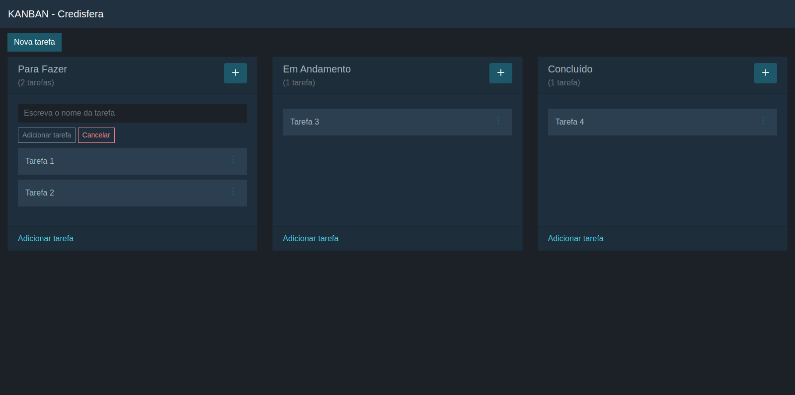

# Topa um Desafio Java?

Essa aplicação está dividida em dois projetos, um frontend e outro backend. O projeto frontend utiliza o VueJS como framework Javascript, e o projeto backend utiliza o SpringBoot como framework Java. Não esqueça de ler os arquivos README.md de cada projeto.

## 1. O Software

O software em execução terá a aparência conforme imagem abaixo:

Nessa pequena aplicação são utilizadas as seguintes tecnologias:

1. Manven para build e gerenciamento de dependências;
2. JPA/Hibernate para mapeamento objeto-relacional;
3. Framework SpringBoot 2;
4. MySQL;
5. Migrations via FlyWay;
6. Java 8;
7. Lombok;
8. Framework Javascript VueJS;
9. NodeJS;

Recomendamos pesquisar sobre cada tecnologia, caso não conheça. O projeto é pequeno, o que permite conhecer como tudo funciona muito rapidamente.

## 2. O Desafio

O desafio será criar novas funcionalidades para essa aplicação de Kanban Web. Essas novas funcionalidades vieram de duas áreas diferentes. O Scrum Master da empresa solicitou que cada uma das tarefas pudessem ter níveis de prioridades diferentes. O Administrador de banco de dados solicitou que as tarefas pudessem ser excluídas fisicamente do banco de dados. Hoje as tarefas são excluídas através de um soft delete.

### 2.1 Você sabe o que é Kanban?

Kanban é um termo japonês que significa “cartão”. O sistema recebeu esse nome pela própria empresa que o desenvolveu, a Toyota. Ele nada mais é do que um sistema ágil e visual para controle de produção ou gestão de tarefas.

Ser ágil significa permitir que as tarefas sejam gerenciadas com rapidez, acompanhando o ritmo de trabalho de equipes que possuem entregas com prazos bem apertados e que estão sempre correndo contra o tempo.

Ser visual significa funcionar através de um esquema de colunas e cartões (que podem ser coloridos), facilitando a visualização do que precisa ser feito por todos os membros da equipe.

### 2.2 Você sabe o que é Soft Delete?

O recurso Soft Delete ou exclusão suave é bem simples: significa que ao invés de excluir os registros do banco de dados, eles são apenas 'marcados' como excluídos. Para fazer isso geralmente criamos uma coluna chamada is_deleted ou apenas deleted que recebe o valor true para indicar que o registro foi marcado para exclusão.

## 3. Requisitos Funcionais

1. Permitir que uma tarefa seja cadastrada com um nível de prioridade. Os níveis de prioridade permitidos são "Alta", "Média" e "Baixa";

2. Permitir que uma tarefa seja excluída fisicamente do banco de dados. O soft delete deve ser removido.

## 4. Requisito Não Funcional

1. Permitir a atualização do banco de dados através de scripts de migração. Veja a pasta src/main/resources/db/migration.

## 5. Testes

Os testes abaixo servirão para garantir a qualidade do software (livre de bugs), evitando que as novas funcionalidades "quebrem" as antigas. 

1. Deve ser possível adicionar uma nova tarefa e informar sua prioridade como "Alta", "Média" ou "Baixa";

2. Deve ser possível editar uma tarefa já cadastrada;

3. Deve ser possível arrastar tarefas (drag'n drop) entre as colunas;

4. Deve ser possível ordenar as tarefas (drag'n drop) nas colunas;

5. Deve ser possível excluir uma tarefa.

## 6. Avaliação

Faça o que é solicitado em cada uma das questões abaixo. No final, envie os vídeos e os códigos-fonte para o e-mail informado.
O total de pontos dessa prova é 10,00. Responda aquilo que conseguir, pois a correção considerará pontuação parcial.

1. (2,0 Pontos) Você conseguiu montar o ambiente de desenvolvimento? Grave um vídeo mostrando como ficou seu ambiente de desenvolvimento (Eclipse, Visual Studio Code, Banco de Dados, NodeJS, etc) e envie para nós.

2. (2,0 Pontos) Você consegiu executar o projeto Frontend e Backend? Grave um vídeo mostrando o software em execução.

3. (5,0 Pontos) Implemente os 2 requisitos funcionais acima, e compacte os projetos (frontend e backend) num arquivo zip.

4. (1,0 Ponto) Você conseguiu executar todos os testes? Grave um vídeo mostrando cada um dos testes.

## 7. Entrega do Desafio

Quando enviar o desafio, envie os vídeos e também o código-fonte.

Desejamos muito sucesso para você!
